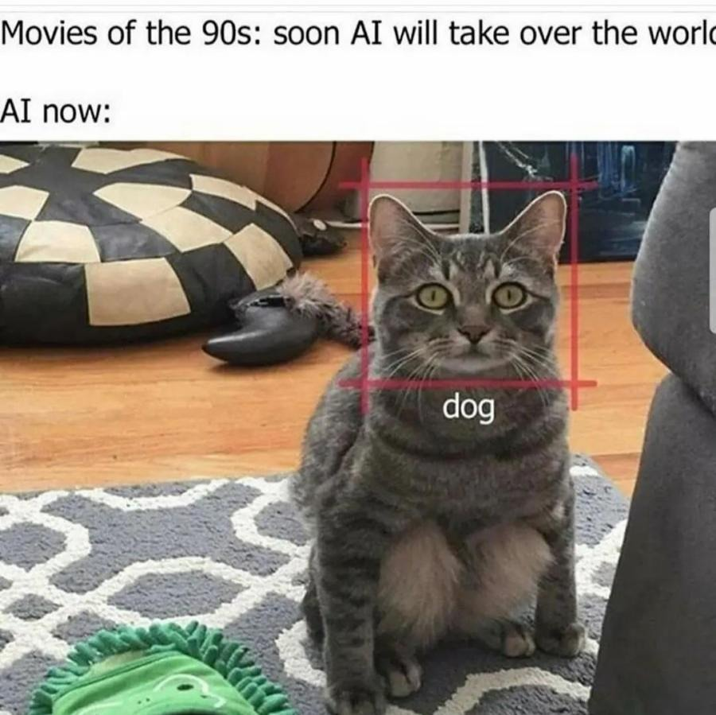

# Algeo02-21052 
Tugas Besar 2 - IF2123 Aljabar Linier dan Geometri

<h2> Kelompok 41 - MKJ </h2>
<h2> <b> Anggota Kelompok </b> </h2>
<h3>
<ol>
<li> Melvin Kent Jonathan - 13521052
<li> Juan Christopher Santoso - 13521116
<li> Kandida Edgina Gunawan - 13521155
</ol>
</h3>

<h2> <b> List Tugas </b> </h2>
<h3> <b> Tugas pada source code </b> </h3>
<h3> Data Training </h3>
<ul>
<li> Pembacaan Image menjadi Matrix dan <i> Image Resizing </i>
<li> Pengubahan Image ke <i> Grayscale </i>
<li> Pencarian nilai rata-rata (mean) dari matriks image data set
<li> Penghitungan nilai matriks kovarian 
<li> Penghitungan <i> eigenvalue </i> dan <i> eigenvector </i> dari matriks kovarian 
<li> Penentuan matriks <i> eigenface </i> dari nilai <i> eigenvector </i>
</ul>
<h3> Face Recognizing </h3>
<ul>
<li> Menghitung <i> eigenface</i> dari suatu image 
<li> Menggunakan metode <i> euclidean distance </i> untuk mencari jarak terpendek dari nilai <i> eigenface </i> dari training image dalam database
</ul>
<h3> Bonus </h3>
<ul>
<li> Pendeteksian wajah secara <i> realtime </i> menggunakan <i> webcam </i>
<li> Pengunggahan video penjelasan algoritma dan aplikasi program ke youtube
</ul>

<h3> <b> Tugas pada laporan </b> </h3>
<ul>
<li> Cover 
<li> Daftar Isi
<li> Bab 1 : Deskripsi Masalah 
<li> Bab 2 : Teori Singkat
<li> Bab 3 : Implementasi program 
<li> Bab 4 : Eksperimen dan analisis
<li> Bab 5 : Kesimpulan, saran, dan refleksi
<li> Daftar Referensi
<li> Lampiran
</ul>

<h2> <b> Keterangan Folder </b> </h2>
<ul>
<li> Folder <i> src </i>

 Berisikan file-file yang mengandung algoritma penghitungan matriks dan pengolahan citra (<i> image </i>). 

<li> Folder <i> test </i>

 Berisikan file-file yang mengandung gambar masukan untuk pengujian 

<li> Folder <i> doc </i>

 Berisikan file laporan 

</ul>
 
<h2> <b> Meme section </b> </h2>
<h4> Istirahat sejenak di masa tubes </h4>
